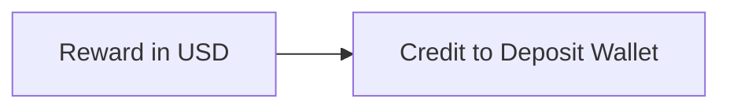
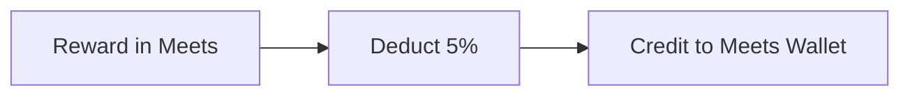

  
  
  
  

#  Labubu

##  1) Deposit

|Chain| Tokens| Credit to Local Wallet|Deposit Method|
|--|--|--|--|
| BSC| USDT (0x55d398326f99059ff775485246999027b3197955) | USDT | Normal Transfer |

>  ***Note**:*

>-  *For **TRON & BSC** chain deposit, every user will assign one unique Deposit Address, user may directly transfer token into self deposit address.*   

  

##  2) Stakings
**A.Hash Mining** 

Minimum Hash Mining is $100.  

| Staking | Payment Method | Added Date| Available |
|--|--|--|--|
| Normal Staking | - 100% USDT Wallet | - | No(Remove at  2025-02-10 15:00:00) |
| With Meets Staking  | - 90% USDT Wallet   - 10%mMeets(Excahnge From USDT rate) | - | No(Remove at  2025-02-10 15:00:00) |
| Staking with Meets Only  | - 100% Meets Wallet   - 100%mMeets(Excahnge From USDT rate) | 2025-02-10 15:00:00 | Yes |

**B.Liquidity Mining**

Minimum Hash Mining is $100.  
| Staking | Payment Method | Added Date| Available |
|--|--|--|--|
| Normal Staking | - 100% USDT Wallet | 2025-02-10 15:00:00 | Yes |
| With Meets Staking  | - 90% USDT Wallet   - 10%mMeets(Excahnge From USDT rate) | 2025-02-10 15:00:00 | Yes |

>  ***Note**:*

>  -  *Only members are allowed to perform real staking, which deducts USDT. Admins do not have permission to add real staking for member.  
>   -  *Only admins are allowed to perform free staking for member. Members cannot add free staking for themselves.
>   -  Start from 10-02-2025, staking will separate 2 different staking type; Hash Mining & Liquidity Mining. Hash Mining stake by Meets value and Liquidity Mining stake by USDT.
>   -  Current Hash Mining will distribute bonuses for Staking Direct Sponsor and Staking Overriding in Meets tokens, as the staking is done using Meets tokens. Previously, both bonuses were distributed only in USDT until February 11, 2025.
>   -  The new Liquidity Mining will distribute bonuses for Staking Direct Sponsor and Staking Overriding in USDT.   

  
##  3) Nodes
Each node costs $3000, and a member can only have one node, either a free one or a purchased one.
>  ***Note**:*

>  -  *When a member buys a node, they receive 3000 in free staking. Free nodes do not include the 3000 staking.
>   -  *Once a user has a purchased or free node, they become eligible to collect the Nodes Investment bonus, calculated on the first day of each month. For example, if a user buys a node on November 8th, they qualify for the bonus when calculated on December 1st, as only 23 days have passed (less than the 30-day limit). This allows them to receive the bonus for all of December. If 30 days have passed, eligibility for the bonus depends on achieving a minimum of $5000 in small zone sales.
  

##  4) Withdrawal

  

|Chain| Wallet | Minimum Withdrawal | Charges |Withdrawal Method|
|--|--|--|--|--|
| BSC| USDT | 50 USDT | $1 | Admin Normal Transfer |
| BSC| MEETS| 50 meets | $1 | Admin Normal Transfer |
| BSC| Tubes USD(Added at 18/12/2024)| 50 TubesUSD | $1 | Admin Normal Transfer |
  

>  ***Note**:*

>  -  ***(USDT Only)** total withdrawal to each chain cannot exceed the total of deposits from particular chain.* 
>  -  ***(Meets Only)** total withdrawal to each chain cannot exceed the total of Meets from particular chain.*  

  

##  5) Bonuses

  ###  Reward in USDT (BCS Chain Only)

>  ***Note**:*

>  -  *Staking Direct Sponsor, Nodes Direct Sponsor, Staking Overriding and Nodes Overriding all reward in Usdt which credit to deposit wallet*
>  -  *Start from 2025-02-11,Staking Direct Sponsor and Staking Overriding will distribute USDT(From Liquidity Mining) and Meets(From Hash Mining)  *
>  
###  Reward in Meets (BCS Chain Only)

>  ***Note**:*

>  -  *Nodes Invest, Staking Invest and Staking Invest Overriding all reward in Meets which credit to Meets wallet*   

###  Ranking (V0-V10) Distribute in USDT
Only Small Zone Sales (Exclude Big Leg) is used to calculate ranking, thus minimum 2 legs (Group) require for rank upgrade.
|Ranking| Small Zone Sales (USD) | Overriding Percentage |
|--|--|--|
| V1 | 2,000 | 0% |
| V2 | 5,000 | 0% |
| V3 | 10,000 | 3% |
| V4 | 50,000 | 6% |
| V5 | 100,000 | 9% |
| V6 | 300,000 | 11% |
| V7 | 500,000 | 13% |
| V8 | 1,000,000 | 14% |
| V9 | 3,000,000 | 15% |
| V10 | 10,000,000 |16% |

###  Ranking (V0-V10) Distribute in Meets
Only Small Zone Sales (Exclude Big Leg) is used to calculate ranking, thus minimum 2 legs (Group) require for rank upgrade.
|Ranking| Small Zone Sales (USD) | Overriding Percentage |
|--|--|--|
| V1 | 2,000 | 10% |
| V2 | 5,000 | 20% |
| V3 | 10,000 | 35% |
| V4 | 50,000 | 50% |
| V5 | 100,000 | 65% |
| V6 | 300,000 | 70% |
| V7 | 500,000 | 85% |
| V8 | 1,000,000 | 90% |
| V9 | 3,000,000 | 95% |
| V10 | 10,000,000 |100% |

  

>  ***Note**:*

>  -  *User need to have minimum **staking of  $100** or buy **Nodes** to activate ranking.*  
>  -  *Small zone sales are calculated based on real staking and the 3000 free staking from node purchases only* 

###  Direct Sponsor Ranking (D1-D3)
|Ranking| Referral Total |  Direct Sponsor Percentage |
|--|--|--|
| D1 | 1 | 1st Level: 2% |
| D2 | 3 | 1st Level: 2%, 2nd Level: 3% |
| D3 | 5 | 1st Level: 2%, 2nd Level: 3%, 3rd Level: 4% |

>  ***Note**:*

>  -  *User need to have minimum **staking of  $100**(included Free Staking) or buy **Nodes**(Included Free Node) to activate ranking.*  
>  
  
###  Overriding & Matching Overriding (Same / Lower Rank)

  

Override on self's network daily ROI reward according Rank's overriding percentage

  

While distribute overriding, if upline（One Level only）is Same / Lower ranking, this upline may get 10% of reward

  

>  ***Note**:*

>  -  *Same / Lower Rank only entitle for **ONE LEVEL UPLINE** only.*   

###  Bonus Type
|No| Type | Request Date | Live Date | Distribute In | Description |
|--|--|--|--|--|--|
| 1 | Staking Direct Sponsor | 2024-08-07 | 2024-09-17 | USDT & Meets | - Bonus calculate based on Hash Mining and Liquidity Mining. Can refer Direct Sponsor Ranking (D1-D3) for the distribution bonus, distribute one time only. - Starting from February 11, 2024, Liquidity Mining will be included.  - Starting from February 11, 2024, Hash Mining only distribute it in Meets token only. | 
| 2 | Nodes Direct Sponsor | 2024-08-07 | 2024-09-17 | USDT | Bonus calculate based on staking. Can refer  Direct Sponsor Ranking (D1-D3) for the distribution bonus, distribute one time only . |
| 3 | Staking Overriding | 2024-08-07 | 2024-09-17 | USDT  & Meets| - Overiding Bonus calculate based on Hash Mining and Liquidity Mining, and distribute bonus based on Ranking (V0-V10) Distribute in USDT, distrbute one time only  - Starting from February 11, 2024, Liquidity Mining will be included.  - Starting from February 11, 2024, Hash Mining only distribute it in Meets token only.|
| 4 | Nodes Overriding | 2024-08-07 | 2024-09-17 | USDT | Overiding Bonus calculate based on nodes and distribute bonus based on Ranking (V0-V10) Distribute in USDT, distrbute one time only |
| 5 | Nodes Invest | 2024-09-09 | 2024-10-01 | MEETS | - 5000 checking every month (Nodes Member)  -member who have node/free-node  -every month SMALL LEG SALE over 5000 (buy node(no buy nodes) / real staking / FreeStaking-from node.)  -check every month for next month(30days) bonus  -do a PopOut/notice for member to view their balance sale.  -if they didn’t get 5000 sale on small leg. They won’t get node bonus(roi on node) on next month .  - 5k / Total Eligible member = Per nodes user bonus |
| 6 | Staking Invest | 2024-09-09 | 2024-10-01 | MEETS | -Before 2025-02-11:   User A staked $1000 (1000 hash)  User B staked $100 (100 hash)   User C staked $100 (100 hash)   Total ROI hash = 1200 hash   20k / 1200 = 16.6667  Total Overriding Hash = 120 hash  So final payout will be:  User A get: 1000 x 16.6667 = 16,666.7 meets  User B get: 100 x 16.6667 = 1666.67 meets  User C get: 100 x 16.6667 = 1666.67 meets   total 20k meets    -Start From 2025-02-11:  User A Old Hash Mining $1000 (1000 hash)  User B Old Hash Mining $100 (100 hash)   User C New Hash Mining $100 (100*2 = 200 Hash)   Total ROI hash = 1300 hash   20k / 1300 = 15.3846 meets  Total Overriding Hash = 130 hash  So final payout will be:  User A get: 1000 x 15.3846 = 15,384.6 meets  User B get: 100 x 15.3846 = 1,538.47 meets  User C get: 200 x 15.3846 = 3,076.93 meets   total 20k meets||
| 7 | Staking Invest Overriding | 2024-09-09 | 2024-10-01 | MEETS | -Before 2025-02-11:   User D get: 100 Hash (example v1 10% of 1000hash)  User E get: 10 Hash (example v1 10% of 100hash)  User F get: 10 Hash (example v1 10% of 100hash)  Total Overriding Hash = 120 hash  20k / 120 = 166.6667  User D get: 100 x 166.6667 = 16666.67 meets  User E get: 10 x 166.6667 = 1666.667 meets  User F get: 10 x 166.6667 = 1666.667 meets   total 20k meets   -Distribute Daily, Distribute % based on Ranking (V0-V10)    - Start From 2025-02-11:   (From Old Hash Mining) User D get: 100 Hash (example v1 10% of 1000hash)  (From New Hash Mining) User E get: 20 Hash (example v1 10% of 200hash (100*2=200hash))  (From Liquidity Mining) User F get: 10 Hash (example v1 10% of 100hash)  Total Overriding Hash = 130 hash  20k / 130 = 153.8461  User D get: 100 x 153.8461 = 15,384.61 meets  User E get: 20 x 153.8461 = 3,076.922 meets  User F get: 10 x 153.8461 = 1,538.461 meets   total 20k meets   -Distribute Daily, Distribute % based on Ranking (V0-V10)|
| 8 | Same Level Bonus | 2024-11-21 | 2024-12-04 | MEETS | 1.Peer-Level Reward 10%  -When the superior and subordinate are at the same level, the superior can receive 10% of the subordinate's dynamic income.   2.Cross-Level Reward 10%  -When the superior's level is lower than the subordinate's, the superior can receive 10% of the subordinate's dynamic income. |
| 9 | Invest Bonus | 2024-12-20 | 2025-01-02 | MEETS | 1.Initially, users can invest for a duration of 180 days, with a minimum investment range of 10,000 MEETS to 50,000 MEETS. Investment options are limited to fixed amounts of 10,000, 20,000, 30,000, 40,000, and 50,000 MEETS. Starting from January 19, 2025, users will have the flexibility to invest any amount ranging from 50 MEETS to 50,000 MEETS.  2.Invest Period:  -180 Days: Earn a 5% bonus per month.  -90 Days: Earn a 4% bonus per month (available from January 18, 2025).  -30 Days: Earn a 3% bonus per month (available from January 18, 2025).  3.The invested amount will be locked for the selected investment period. Once the specified period ends, the locked investment will be released back to the user. |
| 10 | Liquidity Bonus | 2025-01-31 | 2025-02-10 15:00:00 | MEETS | Invest any amount to get 1% roi in meets.  Min 100 usd - max 50,000 usd   |

>  ***Note**:*
>  -  *Start from 2025-02-11, For the new Hash Mining, the hash calculation will be 100 hash plus 50% of its 100 hash value. The old hash mining the remain same. *  
>  -  *Start from 2025-02-20, For the new Hash Mining, the hash calculation will be 100 hash plus 100% of its 100 hash value(Requested amendment on 2025-02-18). The old hash mining the remain same. *  

##  6) Swap (lived 18/12/2024)
Currently, only **Meets** tokens can be swapped to **tubes_usd**. 

>  - Each user has a daily maximum limit of 5,000 meets for swaps.
>  - The exchange process involves converting meet tokens to their USD value, and subsequently converting the USD value to **tubes_usd**.
>  - Token values are retrieved from the Lbank API, which updates every 5 minutes.
