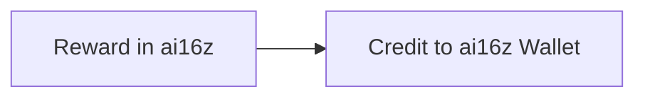
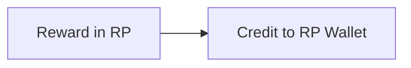
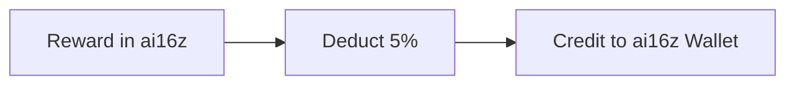
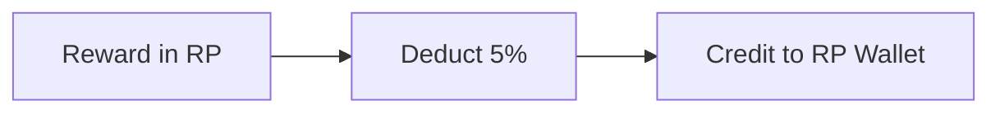

#  Labubu

## cPanel Requirement
- mysql 5.7
- php7.3

##  1) Deposit

|Chain| Tokens| Credit to Local Wallet|Deposit Method|
|--|--|--|--|
| SOL| USDT (8sLmRB4mPhtLucbXqzmAz8SGsbXDyAbf94Tzj427XjYA) | USDT | Normal Transfer |

>  ***Note**:*

>-  *For **SOL** chain deposit, every user will assign one unique Deposit Address, user may directly transfer token into self deposit address.*   

  

##  2) Deposit Game Token
**A.Affect Max Cap Bonus** 
- Admin side can add GT token to user that will increase the total Max Cap Bonus without increase Max Cap Bonus Usage.
- Another action admin can make is increase GT token, but it will increase Max Cap Bonus Usage value.
- If user reach the value of the bonus max cap usage, admin add GT token user will automatically turn into RP token.
- It has 5% charges

### ✅ Exit Rule Explanation
- **Exit** = Once a player reaches the defined profit multiplier, the system automatically transfers the funds into **RP Wallet**, and the account must be **re-activated by depositing again**.  

---

### 📊 Deposit & Exit Multipliers
| Deposit Amount (USDT) | Exit Multiplier |
|-----------------------|-----------------|
| **< $1,001**          | 1.5×            |
| **< $5,001**          | 2.0×            |
| **≥ $5,000**          | 2.5×            |

- **Level Bonus**: From **Hero (Level 4) and above**, players gain an additional **+0.5×** multiplier.  
- **Maximum Exit Multiplier = 4×**.  

---

### 🔄 Cumulative Calculation Logic
- The system calculates based on the **single cumulative deposits** of the player (not per total deposit).  
- When the total deposit crosses a new tier, the **exit multiplier** automatically updates (including level bonuses).  

---

## 💳 Register Point Wallet (RP Wallet)

- **RP Wallet** = A points wallet, valued **1:1 with USDT**.  

### 🎯 Usage
- **Re-deposit**: 80% Cash + 20% RP.  
- **Transfer to Direct Members**: Upline can transfer RP to downline members, who can also use **80% Cash + 20% RP** to deposit. 

**B.Not affect Max Cap Bonus**

- Is just simple ai16z transfer to GT token. But it will decrease the bonus max cap usage.  
- It has 3% charges
  
##  3) Purchase Pass
- Players can **purchase a pass** to unlock more in-game features (such as blind boxes).  
- Passes are available for different durations: **7 days, 15 days, and 30 days**.  
- The pass becomes **effective immediately upon purchase**.

## 4) 📦 Blind Box Purchase & 🎲 Lucky Draw
- Players can **purchase blind boxes** to participate in the game.  
- Each blind box purchase also unlocks the **Lucky Draw**, giving players a chance to win extra rewards.  

After opening a blind box, rewards are granted through a **randomized reward pool**.

---

### 🔑 Unlock Rules
| Blind Box Value (USDT) | Unlock Time | Reward Pool |
|------------------------|-------------|-------------|
| **$50 – $299**         | 8 hours     | Weapons, Equipment |
| **$300 – $999**        | 10 hours    | Weapons, Equipment, Fragments (White / Pink / Orange / Blue) |
| **$1000 – $2000**      | 12 hours    | Weapons, Equipment, LBB Fragments, Limited Edition Fragments |

---

### 🛡️ Reward Types & Values
- **Weapons** → Bow, Axe, Sword, Throwing Knife, Spear, etc. (**$38 / $88**)  
- **Equipment** → Clothes, Gloves, Helmet, Glasses, Wings, Shoes, etc. (**$188 / $388**)  
- **LBB Fragments**:  
  - White / Pink → 6 = 1 piece (**$588**)  
  - Orange / Blue → 6 = 1 piece (**$888**)  
  - Yellow / Cyan → 6 = 1 piece (**$1888**)  
  - Limited Edition (2 types) → 6 = 1 piece (**$8888**)  

---

### ⚙️ Fragment Distribution Logic
- Applies only to **$1000+ blind boxes**.  
- Fragments are **randomly distributed** (max 5 pieces).  
- The **6th fragment** is unlocked based on **performance activity** (*direct referral achievements*).  

| Fragment Value | Performance Requirement |
|----------------|--------------------------|
| **$588**       | 25k                      |
| **$888**       | 50k                      |
| **$1888**      | 100k                     |
| **$8888**      | 500k                     |

👉 Higher performance = higher chance to unlock **rare fragments**.  

---

### 💡 Notes
> - Rewards are **randomized by the system**.  
> - Admins can configure the **reward pool amount ($$$)** in the backend, and the system will distribute accordingly.  

## 5) 🛒 Blind Box Listing & Flash Purchase

### 📌 Feature Requirements
- Blind boxes can be freely traded in the marketplace.  
- Players may **list blind boxes** for sale, and other players can **flash-purchase** them.  
- The system automatically **adds +6%** to the blind box base price, forming the **final market price**.  
- Listing time is set to **8–12 hours**.  
- After the countdown ends, the blind box becomes available for sale.  
- If a player successfully flash-purchases, the transaction is completed:  
  - Blind box is transferred to the buyer’s account.  
  - Seller receives the corresponding earnings.  

---

### 🏬 Marketplace Structure (Labubu Center)
The listing marketplace is divided into **three sections**:  

1. **Blind Box Trading Zone**  
   - Displays *all listed blind boxes* from players.  
   - Includes blind box type & price.  
   - Real-time updates for the latest market activity.  

2. **On Sale (My Listings)**  
   - Displays the current player’s *active listings*.  
   - Includes blind box type & price.  

3. **My Blind Boxes (Pending Listings)**  
   - Displays blind boxes *waiting for listing countdown*.  
   - Includes blind box type, price, and countdown timer.  

| Blind Box Value (USDT) | Listing Unlock Time |
|------------------------|----------------------|
| **$50 – $299**         | 8 hours |
| **$300 – $999**        | 10 hours |
| **$1000 – $2000**      | 12 hours |

---

### 💰 Price Calculation
- Base price = **USDT value of blind box**.  
- System auto-adds **+6% (in Ai16Z tokens)**.  
- **Final Market Price = Listing Price + 6% Auto-Markup**.  

---

### ⚡ Flash Purchase Logic
- Players can select blind boxes they wish to purchase from the market.  
- Upon successful purchase:  
  - The transaction is completed automatically.  
  - Blind box transfers to the **buyer’s account**.  
  - **Seller receives earnings**.  
- Purchased blind boxes also grant **random rewards (Lucky Draw)**.  

---

### 📊 6% Earnings Distribution
From each successful transaction, **6% of the amount** is distributed as follows:  

- **2% → Players** (rebate to the flash-purchasing player).  
- **2% → Alliance Bonus**  
  - Team bonus up to 10 generations.  
  - 2% = 100%, each generation = **10% = 0.2%**.  
- **2% → Game Vault**  
  - Used for Final Big Winner Pool, network dividends, company revenue, and the next winner pool.  

##  6) Withdrawal

  

|Chain| Wallet | Minimum Withdrawal | Charges |Withdrawal Method|
|--|--|--|--|--|
| SOL| USDT | 0 USDT | 0 | Admin Normal Transfer |
  

>  ***Note**:*

>  -  ***(USDT Only)** total withdrawal to each chain cannot exceed the total of deposits from particular chain.* 

  

##  7) Bonuses

  ###  Reward in ai16z (SOL Chain Only)

or

>  ***Note**:*

>  -  *Earning Bonus and Alliance Bonus all reward in ai16z which credit to ai16z wallet*
>  - *If max cap bonus usage > max cap bonus, then it will stop distribute bonus in ai16z token, it will change it to RP tokens*
###  Reward in ai16z (SOL Chain Only)

OR

### a. Ranking (Bronze-Legend) Distribute in ai16z
Only Small Zone Sales (Exclude Big Leg) is used to calculate ranking, thus minimum 2 legs (Group) require for rank upgrade.
|Ranking| Small Zone Sales (USD) | Entitlement buy box qty | Sell Box Restriction qty | Reward Levels |
|--|--|--|--|--|
| Bronze | 0 | 2 | 2 | 2 |
| Silver | 2,500 | 3 | 3 | 4 |
| Gold | 10,000 | 4 | 4 | 5 |
| Platinum | 50,000 | 5 | 5 | 6 |
| Diamond | 250,000 | 6 | 6 | 8 |
| Legend | 500,000 | 7 | 7 | 10 |

>  ***Note**:*

>  -  *Small zone sales are calculated based on Deposit amount / swap from usdt wallet to game wallet only*
>  -  *Rank calculate weekly based on user in game date*
>  -  *Different Rank will affect Bonus Max Cap limit, getting bonus Alliance Bonus, buy box qty and sell box qty* 

###  Bonus Type
|No| Type | Distribute In | Description |
|--|--|--|--|--|--|
| 1  | **Earning**     | Ai16z          | **Earnings Calculation**  Player A buys Player B’s blind box (**$106 = 100 USDT + $6 Ai16z tokens**). - Player B receives a **2% rebate** in Ai16z tokens. - Example: 2% rebate = **$2 Ai16z tokens**. - A **$0.5 service fee** is charged from the player’s earnings. |
| 2  | **Alliance Bonus** | Ai16z       | **Earnings Tiers**  Players reaching certain ranks can earn team bonuses across multiple levels. - A **Gold** player: up to **5 levels**. - A **Legend** player: up to **10 levels**.  🔎 **Note:** 2% = 100%. Each level = **10% = 0.2%**. |
| 3  | **LBB Vault**   | Ai16z          | **2% Allocation – LBB Vault**  2% of each transaction goes into the **LBB Vault** for system maintenance and the future reward pool.  **Funds Distribution (2% = 100%)**: - **45%** → *Final Big Winner Pool* (rewards the last player to purchase a blind box, jackpot-style). - **35%** → *Network Dividend* (distributed step by step according to player levels). - **10%** → *Next Round Pool* (funds the next Final Big Winner Pool). - **10%** → *Company Revenue*. |

  

##  8) Swap 
Currently, only **GT** tokens can be swapped to **USDT** OR **ai16z**. 

>  - Each user have max cap bonus > 0 and max cap bonus usage <= 0 can only swap **ai16z**.
>  - Each user have max cap bonus > 0 and max cap bonus usage > 0 can swap **GT**. Minimum amount is based on max cap bonus.
>  - Token values are retrieved from the Lbank API, which updates every 5 minutes (only for ai16z, GT token is not **real token**).
>  - Swap charges is 3% charges GT Token.
>  - When swap GT to Usdt, it only can be swap based on user_bonus_max_cap_usage and user_bonus_max_cap. user_bonus_max_cap is total user can be swap value, user_bonus_max_cap_usage is record how much user earning and based on this value to swap out. But if user_bonus_max_cap is zero; both user_bonus_max_cap and user_bonus_max_cap_usage is zero; and swapped value record cannot equal or bigger than user_bonus_max_cap_usage, user can't perform any swap action based on above situation.
>  - to check current swap amount (gt to usdt), SELECT SUM(mt_deduct) as total FROM mg_member_transaction WHERE user_id = $user_id AND mt_type = 'swap' AND mt_wallet = 'game' AND mt_status = 'success' AND mt_is_limit_swap = 1 AND mt_is_swap = 0 AND mt_confirmations != 1 

##  9) Swap All OR Reinvest 
| No | Type        | Description |
|----|-------------|-------------|
| 1  | **Swap All** | When a player reaches the Max Cap, they may **swap out the Lock Deposit** (subject to a 5% GT Token fee). If any remaining GT Tokens are left after the swap, they will be automatically converted into the **RP Wallet** (1:1 USDT value). Once Swap All is completed, the account is considered **exited** and requires a **new deposit** to reactivate.   ✨ Note: Swap All can only be performed once the Max Cap bonus (user profits) has been fully swapped out into GT Tokens. |
| 2  | **Reinvest** | After reaching Max Cap, the original deposit (e.g., 1000 USDT) is considered **finished**. If the player reinvests (e.g., 1000*0.97 = 970 USDT), then only **970 × multiplier** is valid for the new round. The new **Lock Deposit = 970**, not 1000 + 970. |

>  ***Note**:*

>  -  *Both action can be made once the Max Cap bonus (user profits) has been fully swapped out into GT Tokens*

## 10) RP Wallet Internal Transfer  
- Players can **transfer RP Points** (1:1 USDT value) within their **own network line**.  
- Transferred RP can be used by downline members for deposits (**80% Cash + 20% RP**).  
- Transfers are **only allowed within the same network line** and cannot be sent outside.
- With 3% charges of RP token

## 11) Aws image link edit
>- Current system box file picture into AWS service, need to get the AWS service own and reconnect to correct server.
>- Current use save picture file:
   1. App\Domains\Admin\Controllers\Market.php ->editMarketPlaceBlindBox()
   2. App\Domains\Admin\Controllers\Collection.php ->editCollection()

## 12) Max cap & Max cap usage edit file
- For the business logic max cap please refer 2) Deposit Game Token, it explain how it caluclate the Max Cap usage.
- Affected table, mg_user, mg_bonus_max_cap_usage_record and mg_member_transaction 
- For the Max Cap Usage, it invlove increase and decrease.
- Increase :
- 1. when User Box have been sold on market, it get Different price Buy price box and Sold price box as GT Token. (Add 6% different price)
  2. when user Swap ai16z to GT Token. (add the GT token amount included charges)
  3. When Admin add GT token for desire user, but if the amount excced the max cap, it will based on max cap usage outstading figure and give it to the user. other amount will turn into RP Token
  4. When user Claim prize reward
- Decrease :
- 1. When user swap GT token to ai16z Token. (not included charges, Amount - [amount * 0.03])

- File included:
- Controller :
- 1. App\Domains\Member\Controllers\Swap.php -> swapGtAiForm()
  2. App\Domains\Member\Controllers\Swap.php -> reinvestSwapAll()
  3. App\Domains\Member\Controllers\Transfer.php -> transferGameWallet() (only method_3 will increase max cap usage)
  4. App\Domains\Admin\Controllers\Wallet.php -> adjustment() (admin side)
- Models :
- 1. App\Models\Marketplace\MainMarket.php ->processPurchaseBellV2()
  2. App\Models\Marketplace\MainMarket.php ->processClaimFragmentPrize()
  3. App\Models\Marketplace\MainMarket.php ->processClaimPrize()

## 13) Config file
- App\Config\App.php
- App\Config\System.php

## 14) Bonus edit file
- Controllers -> App\Domains\Www\Controllers\CronBonus.php (This url run daily at 00:05. it will calculate rank only start distribute alliance bonus. Bonus logic can refer 6)Bonus )
- Models -> App\Models\Bonus\Bonus6.php (Used function can find in above controller function)

## 15) Blindbox trading file edit
- Controller -> App\Domains\Member\Controllers\Market.php -> purchaseBellAjaxV2()
- Models -> App\Models\Marketplace\MainMarket.php ->processPurchaseBellV2()
- Models -> App\Models\Marketplace\Bonus6.php ->calcSoldBoxBonus()
- Models -> App\Models\Marketplace\Bonus6.php ->treasuryBonus()
